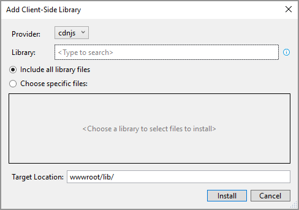
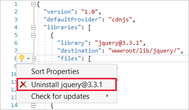

# Use LibMan with ASP.NET Core in Visual Studio

By [Scott Addie](https://twitter.com/Scott_Addie)

Visual Studio has built-in support for LibMan in ASP.NET Core projects, including:

* Support for configuring and running LibMan restore operations on build
* Menu items for triggering LibMan restore and clean operations
* Search dialog for finding libraries and adding the files to your project
* Editing support for *libman.json*&mdash;the LibMan manifest file

[View or download sample code](https://github.com/aspnet/Docs/tree/master/aspnetcore/client-side/libman/samples/) [(how to download)](xref:tutorials/index#how-to-download-a-sample)

## Prerequisites

* Visual Studio 2017 version 15.8 or later with the **ASP.NET and web development** workload

## Add library files

Library files can be added to an ASP.NET Core project in two different ways:

1. [Use the Add Client-Side Library dialog](#use-the-add-client-side-library-dialog)
1. [Edit the LibMan manifest](#edit-the-libman-manifest)

### Use the Add Client-Side Library dialog

Follow these steps to install a client-side library:

* In **Solution Explorer**, right-click the project folder in which the file(s) should be added. Choose **Add** > **Client-Side Library**. The **Add Client-Side Library** dialog appears:

  

* Select the library provider from the **Provider** drop down. CDNJS is the default provider.
* Type the library name to fetch in the **Library** text box. IntelliSense provides a list of libraries beginning with the provided text.
* Select the library from the IntelliSense list. Notice the library name is suffixed with the `@` symbol and the latest stable version known to the selected provider.
* Decide which files to include:
  * Select the **Include all library files** radio button to include all of the library's files.
  * Select the **Choose specific files** radio button to include a subset of the library's files. When the radio button is selected, the file selector tree becomes usable. Check the boxes to the left of the file names to download.
* Specify the project folder, for storing the files, in the **Target Location** text box. As a recommendation, store each library in a separate folder.

  The suggested **Target Location** folder is based on the location from which the dialog launched:
  * If launched from the project root:
    * *wwwroot/lib* is used if *wwwroot* exists.
    * *lib* is used if *wwwroot* doesn't exist.
  * If launched from a project folder, the corresponding folder name is used.

  The folder suggestion is suffixed with the library name. The following table illustrates folder suggestions when installing jQuery in a Razor Pages project.
  
  |Launch location |Suggested folder  |
  |---------|---------|
  |project root (if *wwwroot* exists)       | *wwwroot/lib/jquery/* |
  |project root (if *wwwroot* doesn't exist)| *lib/jquery/*         |
  |*Pages* folder in project                | *Pages/jquery/*       |

* Click the **Install** button to download the files, per the configuration in *libman.json*.
* Review the **Library Manager** feed of the **Output** window for installation details. For example:

  ```console
  Restore operation started...
  Restoring libraries for project LibManSample
  Restoring library jquery@3.3.1... (LibManSample)
  wwwroot/lib/jquery/jquery.min.js written to destination (LibManSample)
  wwwroot/lib/jquery/jquery.js written to destination (LibManSample)
  wwwroot/lib/jquery/jquery.min.map written to destination (LibManSample)
  Restore operation completed
  1 libraries restored in 2.32 seconds
  ```

### Edit the LibMan manifest

All LibMan operations in Visual Studio are based on the content of the project root's LibMan manifest (*libman.json*). To open *libman.json* for editing, the following options exist:

    * Right-click the project in **Solution Explorer** and select **Manage Client-Side Libraries**.
    * Select **Manage Client-Side Libraries** from the Visual Studio **Project** menu.

A *libman.json* file is created in the project root, if it doesn't already exist.

Visual Studio offers rich JSON editing support such as colorization, formatting, IntelliSense, and schema validation. The LibMan manifest's JSON schema is found at [http://json.schemastore.org/libman](http://json.schemastore.org/libman).

With the following manifest file, LibMan retrieves files per the configuration defined in the `libraries` property. An explanation of the object literals defined within `libraries` follows:

* A subset of [jQuery](https://jquery.com/) version 3.3.1 is retrieved from the CDNJS provider. The subset is defined in the `files` property&mdash;*jquery.min.js*, *jquery.js*, and *jquery.min.map*. The files are placed in the project's *wwwroot/lib/jquery* folder.
* The entirety of [Bootstrap](https://getbootstrap.com/) version 4.1.3 is retrieved and placed in a *wwwroot/lib/bootstrap* folder. The object literal's `provider` property overrides the `defaultProvider` property value. LibMan retrieves the Bootstrap files from the unpkg provider.
* A subset of [Lodash](https://lodash.com/) was approved by a governing body within the organization. The *lodash.js* and *lodash.min.js* files are retrieved from the local file system at *C:\\tmp\\*. The files are copied to the project's *wwwroot/lib/lodash* folder.

[!code-json[](samples/LibManSample/libman.json)]

> [!NOTE]
> LibMan only supports one version of each library from each provider. The *libman.json* file fails schema validation if it contains two libraries with the same library name for a given provider.

## Restore library files

Restoration of library files in Visual Studio requires a valid *libman.json* file in the project root. The files are placed in the project at the location specified for each library. Library files can be restored in an ASP.NET Core project in two different ways:

1. [Restore files manually](#restore-files-manually)
1. [Restore files during build](#restore-files-during-build)

### Restore files manually

To trigger a restore operation for all projects in the solution, select the **Restore Client-Side Libraries** option from the solution-level context menu. To trigger a restore operation for a single project, right-click its *libman.json* file in **Solution Explorer** and select **Restore Client-Side Libraries**.

When the restore operation runs:

* The Task Status Center icon on the Visual Studio status bar is animated. Clicking the icon opens a tooltip listing the known background tasks.
* Messages are sent to the status bar and the **Library Manager** feed of the **Output** window. For example:

  ```console
  Restore operation started...
  Restoring libraries for project LibManSample
  Restoring library jquery@3.3.1... (LibManSample)
  wwwroot/lib/jquery/jquery.min.js written to destination (LibManSample)
  wwwroot/lib/jquery/jquery.js written to destination (LibManSample)
  wwwroot/lib/jquery/jquery.min.map written to destination (LibManSample)
  Restore operation completed
  1 libraries restored in 2.32 seconds
  ```

### Restore files during build

LibMan can restore the defined library files as part of the build process. By default, the restore-on-build behavior is disabled. To enable and test it:

* Right-click *libman.json* in **Solution Explorer** and select **Enable Restore Client-Side Libraries on Build** from the context menu.
* Click the **Yes** button when prompted to install a NuGet package. The [Microsoft.Web.LibraryManager.Build](https://www.nuget.org/packages/Microsoft.Web.LibraryManager.Build/) NuGet package is added to your project:

  [!code-xml[](samples/LibManSample/LibManSample.csproj?name=snippet_RestoreOnBuildPackage)]

* Build the project to confirm LibMan file restoration occurs. The `Microsoft.Web.LibraryManager.Build` package injects an MSBuild target that runs LibMan during the project's build operation.
* Review the **Build** feed of the **Output** window for a LibMan activity log:

  ```console
  1>------ Build started: Project: LibManSample, Configuration: Debug Any CPU ------
  1>
  1>Restore operation started...
  1>Restoring library jquery@3.3.1...
  1>Restoring library bootstrap@4.1.3...
  1>
  1>2 libraries restored in 10.66 seconds
  1>LibManSample -> C:\LibManSample\bin\Debug\netcoreapp2.1\LibManSample.dll
  ========== Build: 1 succeeded, 0 failed, 0 up-to-date, 0 skipped ==========
  ```

When the restore-on-build behavior is enabled, the *libman.json* context menu displays a **Disable Restore Client-Side Libraries on Build** option. Selecting this option removes the `Microsoft.Web.LibraryManager.Build` package reference from the project file. Consequently, the client-side libraries are no longer restored on each build.

Regardless of the restore-on-build setting, you can manually restore at any time. To manually restore, select the **Restore Client-Side Libraries** option from the *libman.json* context menu.

## Clean library files

LibMan can remove all library files that were previously restored in Visual Studio. To clean, right-click the *libman.json* file in **Solution Explorer** and select **Clean Client-Side Libraries**. To prevent unintentional removal of non-library files, the clean operation doesn't delete whole directories. It only removes files that were included in the previous restore.

Messages are sent to the status bar and the **Library Manager** feed of the **Output** window. For example:

```console
Clean libraries operation started...
Clean libraries operation completed
2 libraries were successfully deleted in 1.91 secs
```

## Uninstall library files

To uninstall library files:

* Open *libman.json*.
* Position the caret inside the corresponding `libraries` object literal.
* Click the light bulb icon that appears in the left margin, and select **Uninstall \<library_name>@\<library_version>**:

  

Alternatively, you can manually edit the *libman.json* file and save. The restore operation runs on save and removes the library files that are no longer part of the LibMan manifest.

## Update library version

To check for an updated library version:

* Open *libman.json*.
* Position the caret inside the corresponding `libraries` object literal.
* Click the light bulb icon that appears in the left margin, and hover over **Check for updates**.

LibMan checks for a library version newer than the version installed. The following things can occur:

* A **No updates found** message is displayed if the latest version is already installed.
* The latest stable version is displayed if not already installed.

  

* If a pre-release is available, which is newer than the installed version, the pre-release is displayed too.

To downgrade to an older library version, manually edit the *libman.json* file. When the file is saved, the LibMan restore operation removes redundant files from the previous version and adds new and updated files from the new version.

## Additional resources

* [LibMan GitHub repository](https://github.com/aspnet/LibraryManager)
